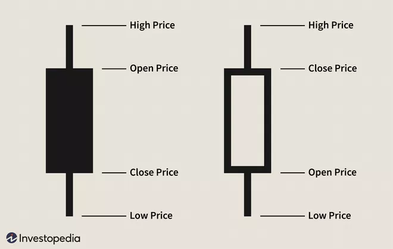

# Basic Trading Analysis

Candles show how much an asset has moved over a period of time. 

The body shows how much a price has moved over said period of time from the opening price to the closing. The wicks shows the over that period of time the highest and lowest prices, these two in conjunction can represent trends.

## Patterns

A series of set candle patterns indicate price movements, trends and momentum.

### Bearish engulfing pattern

Small positive prices increase (generally green) engulfed by large negative price decrease (generally red). 

**Indicates sellers are back in control, trend will be prices continuing to decline**

### Bullish engulfing pattern

Opposite pattern of bearish.

### Evening star 

Change in price direction with a larger body than previous.

Bear/Bullish depending on direction.

### Harami

If there is a change in price direction in with a smaller body than previous.

### Rising Three

Consecutive days of opposite movement within the last body then a change with a larger body of the previous.